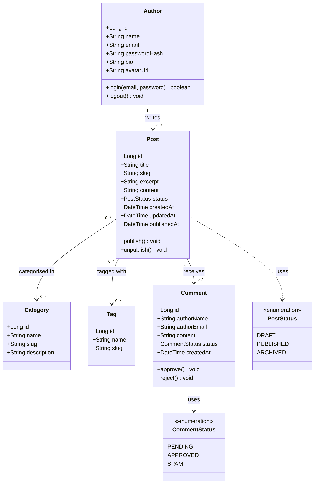
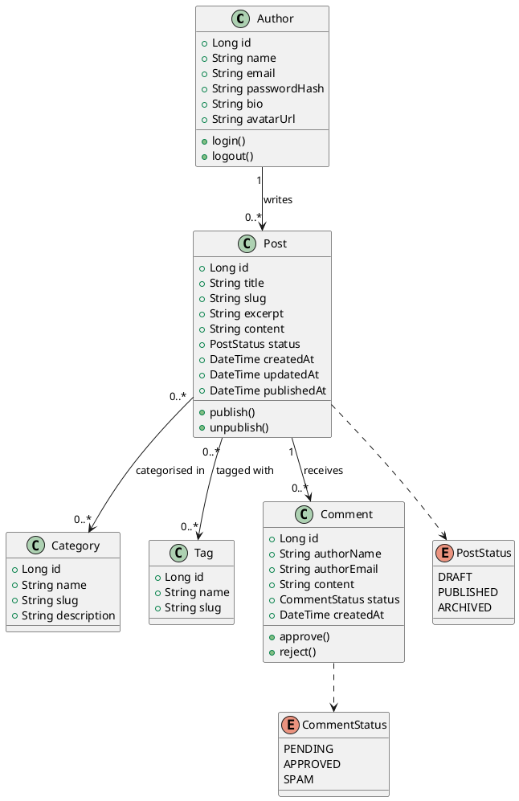

# Domain Model

This document describes the domain model of the **Personal Blog** as a UML class
diagram, followed by a description of each entity and the relationships between them.

The diagram is written in [Mermaid](https://mermaid.js.org/) so it renders directly
on GitHub. A PlantUML version is provided at the end for tools that prefer it.

---

## UML Class Diagram

---

## Entities

### Author
The single owner of the blog. Authenticates to access the admin area and is the
author of every post.

| Attribute | Type | Notes |
| --- | --- | --- |
| `id` | Long | Primary key |
| `name` | String | Display name |
| `email` | String | Unique, used for login |
| `passwordHash` | String | Never stored in plain text |
| `bio` | String | Shown on the About page |
| `avatarUrl` | String | Optional profile image |

### Post
A blog article. Has a lifecycle expressed by `PostStatus` (draft → published →
archived). Owns its comments.

| Attribute | Type | Notes |
| --- | --- | --- |
| `id` | Long | Primary key |
| `title` | String | Required |
| `slug` | String | URL-friendly, unique |
| `excerpt` | String | Short summary for listings |
| `content` | String | Full body (Markdown/HTML) |
| `status` | PostStatus | DRAFT / PUBLISHED / ARCHIVED |
| `createdAt` / `updatedAt` / `publishedAt` | DateTime | Timestamps |

### Category
A broad topic a post belongs to (e.g. "Travel", "Tech"). A post can be in several
categories; a category groups many posts. **Many-to-many.**

### Tag
A fine-grained keyword attached to a post (e.g. "docker", "berlin"). **Many-to-many**
with posts.

### Comment
A reader's response to a post. Moderated via `CommentStatus`. Belongs to exactly one
post. The commenter is not a registered user — only a name and email are captured.

---

## Relationships Summary

| From | To | Cardinality | Meaning |
| --- | --- | --- | --- |
| Author | Post | 1 → 0..* | An author writes many posts; each post has one author. |
| Post | Category | 0..* ↔ 0..* | Posts are filed under many categories and vice versa. |
| Post | Tag | 0..* ↔ 0..* | Posts carry many tags and vice versa. |
| Post | Comment | 1 → 0..* | A post receives many comments; each comment belongs to one post. |

---

## PlantUML (alternative)

